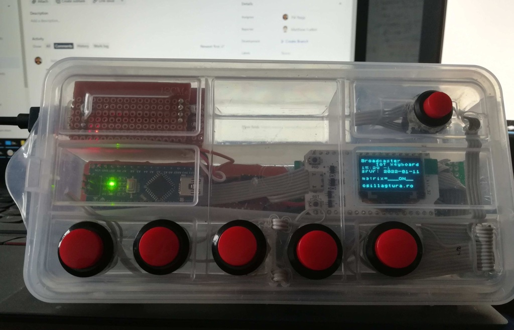

# attiny85_usb_keyboard_driven_through_uart
A solution I found to have single hardware buttons for long and complex keyboard sequences like global shortcut keys

Below an image and a demo of the device with Open Broadcaster Software https://www.youtube.com/watch?v=3SBgxMVDaiE

